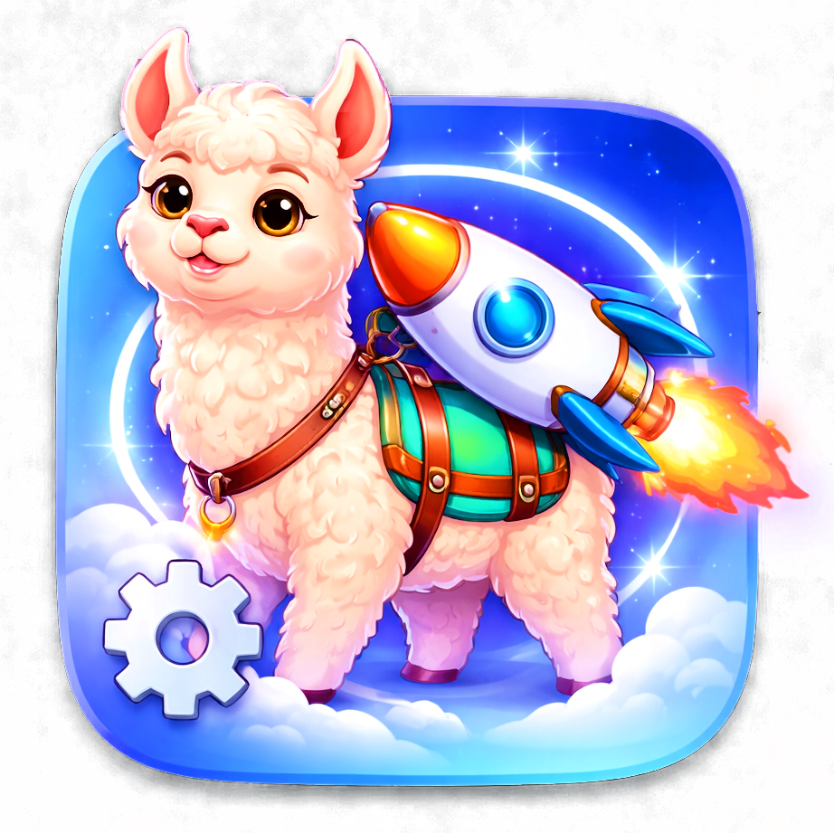

# llauncher – GUI for llama.cpp

A mixer-style launcher for controlling llama.cpp with presets, benchmarking, and GPU monitoring.

## Features

◆ **Hugging Face Model Download**  
Download GGUF models directly from Hugging Face Hub:
- Browse and search model repositories
- Progress bar with centered percentage display
- Cancel mid-download (graceful shutdown + partial file cleanup)
- Overwrite confirmation for existing local files
- i18n translations (de/en)
- Saved to: configured model directory

◆ **Parameter Control** like on a mixing console  
Each parameter has a slider (integer) or float slider with edit field:
- `-c` Context Size (dynamic maximum from GGUF)
- `-n` Max Tokens
- `-t` CPU Threads
- `-b` Batch Size
- `-ngl` GPU Layers with "all" checkbox
- `--temp`, `--top-p`, `--repeat-penalty` (float sliders with decimal places)
- `--flash-attn` (combo: on/off)
- `--host` (text input)

◆ **Save & Load Presets**  
Save current configuration via dialog, restore via dialog.  
Saved to: `~/.llauncher/presets.json`

◆ **Benchmarking**  
Run test inference and save results:
- TPS (tokens per second) automatically calculated
- Free-text field for quality rating (1-5 or custom text)
- Saved to: `~/.llauncher/benchmarks.json`
- Live output without cropping

◆ **Model Selection + Path Configuration**  
- llama.cpp directory + executable selection
- Dropdown with all `.gguf` files from model directory
- mmproj path for vision models (saved with presets)
- Paths saved in `~/.llauncher/config.json`

◆ **Debug Output**  
Full command line (1:1 as executed) and live output during runtime

◆ **GPU Monitoring (nvidia-smi)**  
Live data in status area:
- GPU utilization (%)
- VRAM usage (MB)
- Temperature (°C)

◆ **KDE Plasma Look**  
Dark theme with `#0078d7` accent color, adapts to system settings

◆ **Start/Stop Button**  
- `Ready to go` (green)
- `Loading model...` (orange)
- `Loaded` (green)
- `Stopped` (red)
- `Failed` (red)

## Installation

Prerequisites:
```bash
pip install PyQt6 psutil PyMuPDF
```

For PDF benchmarking, PyMuPDF is required. Alternative: `pip install pdfplumber`

Arch Linux: `pacman -S python-pyqt6 python-psutil`

## Starting

```bash
python3 llauncher.py
```

## File Structure

```
~/llama.cpp/          # llama.cpp build directory
~/models/             # GGUF models
~/.llauncher/         # Configuration and presets
├── config.json       # Paths and last settings
├── presets.json      # Saved presets
└── benchmarks.json   # Benchmark results

./                      # Project directory
├── llauncher.py        # Main UI
├── gguf_utils.py       # GGUF parsing and CPU detection
├── storage.py          # JSON I/O for config/presets/benchmarks
├── gpu_monitor.py      # GPUMonitor QThread with nvidia-smi polling
├── process_runner.py   # ProcessRunner + terminate_by_pid()
├── float_slider_sync.py# DirectClickSlider + Float/Integer Slider Creation
├── help_parser.py      # Dynamic parameter extraction from llama-server --help
├── preset_manager.py   # Preset dialogs (save/load/benchmark rating)
├── benchmark_runner.py # Benchmarking logic and HTTP benchmarker
├── hf_download_dialog.py# Hugging Face model download dialog (progress, cancel)
├── model_info_fetcher.py# Running model info via HTTP API
└── README.md
```

## Example Configuration

For fast inference on consumer hardware:
- Threads: 8 (matches physical cores)
- GPU Layers: as many as VRAM allows (usually 30-45)
- Context Size: 2048 (or higher for long contexts)
- Max Tokens: 512 (standard), -1 for unlimited

For vision models:
1. Select model (.gguf with ViT support)
2. Enter mmproj path (e.g., `~/models/vision/mmproj-model-f16.gguf`)
3. Start

## Technical Details

- **GUI Framework**: PyQt6
- **GPU Monitoring**: nvidia-smi (NVIDIA-only)
- **Process Management**: QThread with multi-signal shutdown (SIGINT→SIGTERM→SIGKILL)
- **Styling**: Qt Style Sheet (QSS)
- **Modularized**: ~1500 lines in llauncher.py, other modules < 500 lines
- **Signal Handling**: Custom `object` type signals to avoid PyQt6 32-bit int truncation on large value emissions (progress sizes)

## Extension Possibilities

- AMD GPU support (radeontop/virtuoso)
- Batch inference (multiple models in parallel)
- WebUI version with QtWebEngine
- More llama.cpp parameters (dynamically extracted from `--help`)
